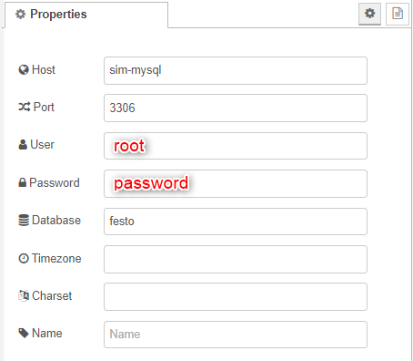
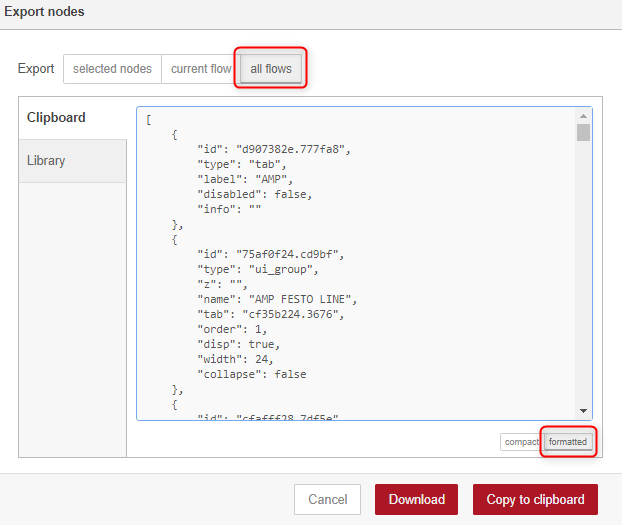

# pdmSim
### Introduction
After setting up the [PdM Platform](https://github.com/fash-aryan/pdmPlatform), this simulation can be run. The simulation instance consists of three containers:
* **[Node-RED](https://hub.docker.com/r/nodered/node-red)**
* **[MySQL](https://hub.docker.com/_/mysql)**
* **[Mosquitto MQTT Broker](https://hub.docker.com/_/eclipse-mosquitto)**

The `sim.sh` script can take one of the arguments:
* Create and run a new simulation instance: `./sim.sh run`
* Remove the simulation instance: `./sim.sh rm`
* Remove the running instance and create a new one: `./sim.sh reload`

### Using pdmSim Repository for the First Time
1. Execute `./sim.sh run` command in the parent directory.

2. Access Node-RED via [localhost:1880](http://localhost:1880). To access the dashboard's UI navigate to [localhost:1880/ui](http://localhost:1880/ui).

3. The secrets and credentials used by the *nodes* are not transferred. The following credentials must be added:
***FESTO DB* mysql node**

4. Deploy the flow by clicking on 

**Important Note:** Rebuilding the images causes the crenetials to be lost. Perform the fourth step for every build triggered by `./sim.sh reload` command. It also causes all the other changes to nodes to be lost. To persist new changes the base `flow.json` file in the parent directory must be updated before running this command or `./sim.sh rm`.

### Adding New Nodes to Node-RED Image
To push new features added to the Node-RED flow:
1. Click on **Export** in the settings tab. Make sure **formatted** and **all flows** options are chosen.

2. Either A or B:
A) **Download** the `flows.json` file and replace it with curernt one in the `nodered-init` directory.
B) Choose **Copy to clipboard** option and paste/replace the current `flows.json` content directly.

### Installing New Node Packages in Node-RED
To add a new Node-RED package:
1. Add a `RUN npm i <package-name>` line to the **Dockerfile** file in `nodered-init` directory.
2. Execute `./sim.sh reload` command.